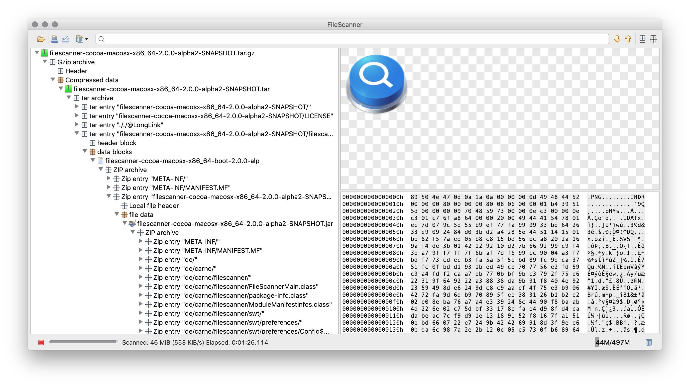

### About FileManager
Did you ever wonder what is inside a file. The FileScanner tool is capable to detect and decode several file formats even recursively. Data structures can be inspected in detail. Contained data can be viewed or exported.

This makes FileScanner a suitable tool for those who want to see the details or want to get a better understanding of a file format.

If you want to see a specific format be supported by FileScanner, just drop me a
message with a link to an example via [info@filescanner.org](mailto:info@filescanner.org)

#### Installation & usage:
A Java SE 8 Runtime Environment is required to run FileScanner. FileScanner uses on the [SWT UI toolkit](https://www.eclipse.org/swt/) and builds are available for the following platforms:
* macOS 64bit (cocoa-macosx-x86_64)
* Linux GTK 64bit (gtk-linux-x86_64)
* Windows 64bit (win32-win32-x86_64)

Download the latest version from the project's [releases page](https://github.com/hdecarne/filescanner/releases/latest).


The provided installer/launcher packages have been created using the multi-platform installer builder
[Install4J](https://www.ej-technologies.com/products/install4j/overview.html). Simply run the installer suitable for your platform to install the application and keep it up-to-date.

If you downloaded one of the generic archives, simply extract it to a folder of your choice.
The archive contains a single executable Jar as well as a folder with the license information. Invoke the application by either double clicking the jar or invoke the command

```
java -jar filescanner<platform>-boot-<version>.jar [command line arguments]
```

in a terminal. The application command line supports the following options:

```
filescanner-<platform>-boot-<version> [--verbose|--debug] [file]

--verbose
	Enable verbose logging.
--debug
	Enable debug logging.

file
	The file to scan.
```

#### Changelog:
See [CHANGELOG.md](https://github.com/hdecarne/filescanner/blob/master/CHANGELOG.md).
